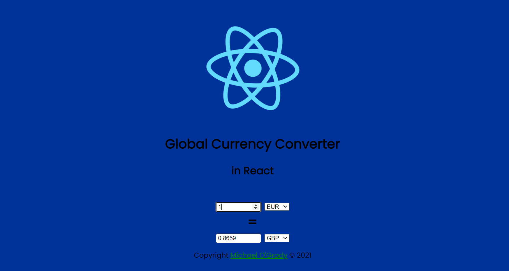

# React Currency Converter

> Simple Currency Converter using [ExchangeRate-API](https://v6.exchangerate-api.com)

- [x] useEffect
- [x] useState
- [x] fetchAPI / .then()/.catch()

# Instructions

- clone repo
- run `yarn install`
- run `yarn run server` to start up the JSON Server
- run `yarn run start` to start up the frontend UI

<h1 align="center">

</h1>
